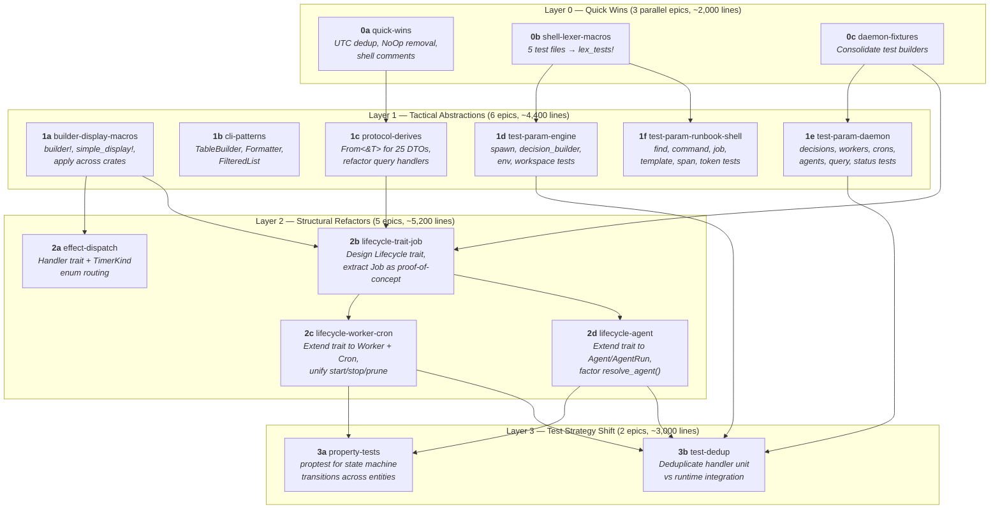

# Refactor Roadmap

Target: ~25% reduction in codebase volume (~26,000 lines from 105,000)
with no change in functionality or test coverage.

Work is organized into four layers with ~16 epics total. Each epic is
scoped to fit a single agent session (~500-2000 lines changed, 5-15 files
touched). Epics within a layer can run in parallel unless edges show
otherwise. All epics must pass `make check` before merging.



---

## Layer 0 — Quick Wins

No design decisions, no dependencies. All three epics can run in parallel.

### Epic 0a: `quick-wins`
> [QUICK_WINS](QUICK_WINS.md)

- Replace duplicated `format_utc_now()` / `days_to_civil()` in `breadcrumb.rs` with import from `time_fmt`
- Remove `NoOpSessionAdapter` and `NoOpNotifyAdapter` (source, tests, re-exports)
- Trim shell crate comment density from 51% to ~20%
- ~8 files, ~500 lines removed

### Epic 0b: `shell-lexer-macros`
> [TEST_COMPRESSION](TEST_COMPRESSION.md) §1

- Convert `variables.rs` (930 lines), `substitution.rs` (622), `errors.rs` (337), `nesting.rs` (335), `expansions.rs` (139) to use existing `lex_tests!` / `lex_error_tests!` macros from `macros.rs`
- 5 files, ~1,200 lines removed

### Epic 0c: `daemon-fixtures`
> [TEST_COMPRESSION](TEST_COMPRESSION.md) §2

- Consolidate `make_job()`, `make_breadcrumb()`, `make_worker()`, etc. from `mutations/test_helpers.rs` and `query_tests/mod.rs` into a shared module
- Update imports across mutation and query test files
- ~6 files, ~300 lines removed

---

## Layer 1 — Tactical Abstractions

New shared infrastructure. All six epics can run in parallel once their
Layer 0 dependencies are met.

### Epic 1a: `builder-display-macros`
> [MACRO_BOILERPLATE](MACRO_BOILERPLATE.md) §1

- Define `builder!` macro (or use a derive) and apply to `AgentRunBuilder`, `JobConfigBuilder`, `AgentSpawnConfig`, `EscalationDecisionBuilder`
- Define `simple_display!` macro and apply to 8+ enums with variant-to-string Display impls
- ~9 files across core/engine/adapters, ~300 lines removed

### Epic 1b: `cli-patterns`
> [CLI_PATTERNS](CLI_PATTERNS.md)

- Create `TableBuilder` for list formatting with conditional columns
- Create `Formatter` trait or helper for text/JSON output branching
- Create `FilteredList` for filter-by-project, sort, limit logic
- Apply across job, agent, session, worker, queue, cron, decision commands
- ~8 files in cli, ~600 lines removed

### Epic 1c: `protocol-derives`
> [DERIVE_PROTOCOL_CONVERSIONS](DERIVE_PROTOCOL_CONVERSIONS.md)

- Write `From<&T>` impls for all 25 protocol DTO structs in `protocol_types.rs` and `protocol_status.rs`
- Refactor ~21 manual struct-literal conversion sites in `query.rs`, `query_agents.rs`, `query_status.rs`, `query_orphans.rs`, `query_queues.rs`
- ~9 files, ~1,000 lines removed
- Depends on: **0a** (clean compile base)

### Epic 1d: `test-param-engine`
> [TEST_COMPRESSION](TEST_COMPRESSION.md) §3a

- Parameterize test groups in `spawn_tests.rs` (~4 groups), `decision_builder_tests.rs` (~5 groups), `env_tests.rs` (~3 groups), `workspace_tests.rs` (~4 groups), `activity_logger_tests.rs` (~3 groups)
- ~5 files, 15-20 groups, ~500 lines removed
- Depends on: **0b** (shell macros done first to establish pattern)

### Epic 1e: `test-param-daemon`
> [TEST_COMPRESSION](TEST_COMPRESSION.md) §3b

- Parameterize test groups in `decisions_tests.rs` (~5 groups), `workers_tests.rs` (~4 groups), `crons_tests.rs` (~3 groups), `agents_tests.rs` (~3 groups), `query_tests/status_tests.rs` (~3 groups), `query_tests/entity_tests.rs` (~2 groups), `query_tests/job_tests.rs` (~2 groups)
- ~9 files, 25-35 groups, ~800 lines removed
- Depends on: **0c** (fixtures consolidated first)

### Epic 1f: `test-param-runbook-shell`
> [TEST_COMPRESSION](TEST_COMPRESSION.md) §3c

- Parameterize test groups in `find_tests.rs` (~5 groups), `command_tests.rs` (~4 groups), `job_tests.rs` (~3 groups), `template_tests.rs` (~3 groups), `span_tests.rs` (~3 groups), `token_tests.rs` (~3 groups), `validator_tests.rs` (~3 groups)
- ~11 files, 20-25 groups, ~700 lines removed
- Depends on: **0b** (shell test patterns established)

---

## Layer 2 — Structural Refactors

The highest-impact work. Epic 2a is independent. Epics 2c and 2d can
run in parallel after 2b establishes the trait.

### Epic 2a: `effect-dispatch`
> [MACRO_BOILERPLATE](MACRO_BOILERPLATE.md) §2-3

- Refactor `executor.rs` to dispatch effects via trait-based handlers or macro-generated match instead of a 747-line monolith
- Replace string prefix routing in `timer.rs` with a parsed `TimerKind` enum
- ~4 files in engine, ~700 lines removed
- Depends on: **1a** (macro infrastructure)

### Epic 2b: `lifecycle-trait-job`
> [GENERIC_ENTITY_LIFECYCLE](GENERIC_ENTITY_LIFECYCLE.md) §1

- Design the `Lifecycle` trait (state transitions, lifecycle hooks, prune/resume interface)
- Extract Job as the proof-of-concept implementation
- Refactor `handlers/lifecycle.rs` to use the generic trait
- Refactor `listener/mutations/jobs.rs` to use shared patterns
- Update Job-related tests
- ~8 files across engine + daemon, ~800 lines removed
- Depends on: **1a** (builder macros), **1c** (protocol derives), **0c** (fixture consolidation)
- This is the critical path epic — its design determines the shape of 2c, 2d, 3a, 3b

### Epic 2c: `lifecycle-worker-cron`
> [GENERIC_ENTITY_LIFECYCLE](GENERIC_ENTITY_LIFECYCLE.md) §2

- Implement `Lifecycle` for Worker and Cron
- Refactor `handlers/worker/{lifecycle,dispatch,completion,polling}.rs` and `handlers/cron.rs` + `cron_timer.rs`
- Refactor `listener/workers.rs` and `listener/crons.rs` to use shared patterns
- Unify start/stop/prune across entity types
- ~12 files, ~1,500 lines removed
- Depends on: **2b** (trait exists)

### Epic 2d: `lifecycle-agent`
> [GENERIC_ENTITY_LIFECYCLE](GENERIC_ENTITY_LIFECYCLE.md) §3

- Implement `Lifecycle` for Agent/AgentRun (handling dual ownership: Job-owned vs standalone)
- Refactor `handlers/agent.rs` to use the generic trait
- Factor the 3x-duplicated agent resolution logic into `resolve_agent_to_session()`
- Refactor `listener/mutations/agents.rs` and `listener/decisions.rs`
- ~10 files, ~1,000 lines removed
- Depends on: **2b** (trait exists), can run in parallel with **2c**

---

## Layer 3 — Test Strategy Shift

Enabled by the generic lifecycle trait. Both epics can run in parallel.

### Epic 3a: `property-tests`
> [TEST_COMPRESSION](TEST_COMPRESSION.md) §4

- Add `proptest` dependency and infrastructure
- Write property tests for state machine transitions parameterized across entity types via the `Lifecycle` trait
- Replace example-based tests that cover the same state space
- ~8 files, ~2,000 lines removed
- Depends on: **2c** + **2d** (all entities implement trait)

### Epic 3b: `test-dedup`
> [TEST_COMPRESSION](TEST_COMPRESSION.md) §5

- Identify handler unit tests that overlap with runtime integration tests
- Remove the redundant layer (keep whichever has better diagnostic value)
- Consolidate remaining tests using parameterized patterns from Layer 1
- ~10 files, ~1,000 lines removed
- Depends on: **2c** + **2d** (lifecycle trait), **1d** + **1e** (parameterized patterns)

---

## Execution Plan

### Parallelism Map

```
Phase 1:  [0a] [0b] [0c]                          ← 3 parallel
Phase 2:  [1a] [1b] [1c] [1d] [1e] [1f]           ← 6 parallel
Phase 3:  [2a] [2b]                                ← 2 parallel
Phase 4:       [2c] [2d]                           ← 2 parallel
Phase 5:  [3a] [3b]                                ← 2 parallel
```

Max parallelism: 6 (Phase 2). Critical path: 0c → 2b → 2c/2d → 3a.

### Cumulative Savings

| Layer | Epics | Source | Tests | Total | Cumulative |
|-------|-------|--------|-------|-------|------------|
| 0 | 3 | ~500 | ~1,500 | ~2,000 | 2,000 (2%) |
| 1 | 6 | ~1,900 | ~2,000 | ~3,900 | 5,900 (6%) |
| 2 | 4 | ~4,000 | ~2,000 | ~6,000 | 11,900 (11%) |
| 3 | 2 | — | ~3,000 | ~3,000 | 14,900 (14%) |

These are conservative per-epic estimates. Each epic should look for
additional reduction opportunities beyond its stated scope as it works
through the files.

### Acceptance Criteria

- Total codebase is at or below 86,000 lines (19,000 lines removed from 105,000)
- All existing tests pass; `make check` is green
- Test coverage does not decrease
- No change in functionality or public CLI behavior

### Risk Notes

- **Layer 0-1** (9 epics): Low risk. Mechanical, high test coverage.
- **Epic 2b** is the highest-risk single epic — the trait design determines
  whether 2c, 2d, 3a, and 3b succeed. Consider using `oj run idea` first
  for a plan-only pass before committing to implementation.
- **Layer 3**: Medium risk. Property tests must cover the same state space
  as the example tests they replace. Run both in parallel during transition.
